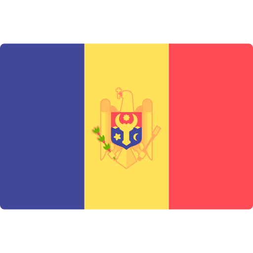

### About me
I am 21 and one years old, studying for a degree in applied computer science. I personally study Java and web development using the *Spring Framework*. At the moment, I am developing a platform for creating school tests, a rating system and achievements based on *Spring Cloud* microservices.

#### My professional skills

 -  - Good knowledge of *Java Core, Stream API and Collection API.* I studied multithreading and the Concurrent package.  
    * I know about such problems as the *DeadLock, the race condition*, and I know how to solve these problems.
****
*  - I have good technical skills in developing web applications based on the *Spring Framework* using *Spring Boot*. 
    * I have an understanding of the *life cycle of beans and BeonPostProcessors*. I understand what methods are used to implement inversion of control (**IoC**) container.

1) **Spring Web** - I use REST API and MVC to develop my projects. I am able to clearly divide the application into a *servisive layer*, a *database interaction layer* (**DAO layer**) and a *controller layer* for interaction with the *client*.
2) **Spring Data** - from this module, I most often use **Data JPA**, since it most conveniently allows you to link entities from Spring and the database, another advantage is the convenient writing of methods for accessing the database using *Query Methods*.
    * **Data JDBC** - I also use *@Query JPQL-requests* to write more flexible and productive methods. 
 
3) **Spring Test** - I can write simple *Unit tests* for my applications using **JUnit** and **MockMvc**.
    * I can also write *Integration Tests* using **TestContainers**.
4) **Spring Security** - I have good knowledge of working with this module. I implemented a *role system, basic authentication and authorization* in my applications by configuring **SecurityFilterChain** and **UserDetailsService**
    1)  - I also used *JWT tokens* in my projects, implemented **JWTSevice** and **JWTFilterChain** with the generation of *access and refresh tokens*.
    2) **Oauth2** -I know medium knowledge of this protocol, when implementing this authorization protocol, I used *JWT*.
    3) **Keycloak** - I also connected keycloak in one of my projects for easier access control. I used this system basic, but I do not have deep knowledge of this product.
5) **Spring Cloud** - I use it in my course work. I am currently actively studying this Spring module.
    1) **Spring Netflix Eureka Server and Client** - I use this module to create a server (*Eureka Server*) in which I register microservices using *Eureka Cient*.
    2) **Spring Cloud Gateway** - I use this gateway as the central point of access to the other microservices and I know how to configure it.
****
 - this is the main **DBMS** that I use in my projects. For me, it has advantages over other databases, one of them is the ability to save data in *JSON* format and work with *Enum types*. 
1) **SQL** - I have excellent knowledge of this language.
    - I know the basic **normalization levels** of databases.
    - **ACID principles**. How to work with transactions and what levels of transaction isolation there are.
    - I know how to use **JOIN's** queries in practice.
    - Basic knowledge of functions and triggers.
***
 -  I also use docker containers in development. I can write and build **dockerfile's** and *docker-compose* files for my projects.
***
 - I also use *Redis storage* in my projects to improve performance and store data in caches. I have a basic knowledge of this technology.
*** 

 - When it comes to message brokers, I usually use *Rabbit* because it is easier to set up than *Kafka* and its functionality is sufficient for me so far.
***
#### Additional skills

***
#### My Contacts
- : **alekseev.sserghei@gmail.com** 
*  **t.me/is_alexeev**

**Telphone Number:**  **(+373) 79434969**

